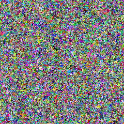
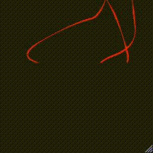
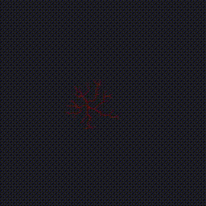
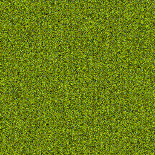
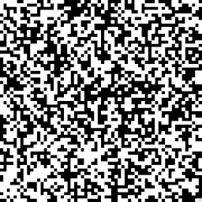
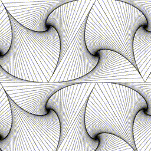
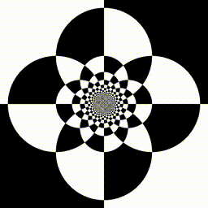
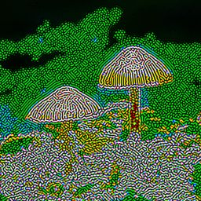

# Generative Art

Simple algorithms generating aesthetically pleasing stuff.

## Content

Name | Illustration
---- | ------------
[Belousov-Zhabotinsky Cellular Automaton](belousov-zhabotinsky) | 
[Bernoulli Percolation](bernoulli-percolation) | 
[Chaikin Curves](chaikin-curves) | 
[Leaf Venation](leaf-venation) | 
[Liquid Vapor](liquid-vapor) | 
[Molnart](molnart) | 
[Persistence of Vision](persistence-of-vision) | 
[Pursuit Curves](pursuit) | 
[Space Inversion](space-inversion) | 
[Turing Patterns](turing-patterns) | 
[Wada Bassins](wada) | 

You may also want to check the [IDEAS.md](IDEAS.md) document for future developments.

Some old scripts moved to dedicated repositories:
* Flatland → https://codeberg.org/ychalier/flatland
* Granular Synthesis → https://codeberg.org/ychalier/granular-synthesis
* Randomart → https://codeberg.org/ychalier/randomart
* Swarm → https://codeberg.org/ychalier/swarm 

