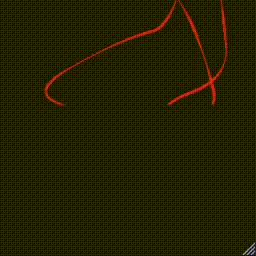

# Chaikin Curves

[Checkout the demo here.](https://chalier.fr/generative-art/chaikin-curves/index.html)

## Description

*Chaikin Curves* come from a 1974 paper by George Merrill Chaikin, *An Algorithm for High-Speed Curve Generation*. They are an alternative to the [Bézier curves](https://en.wikipedia.org/wiki/B%C3%A9zier_curve), that appeared in the 60s. The idea is to start with a few vertices, joined by edges. Then, recursively, for each edge, introduce new vertices at 25% and 75% (with respect to the segment), and remove the old ends. Each iteration thus makes the broken line look more curved. Repeat as much as you want.

You may find more details in an [Acerola](https://www.youtube.com/c/Acerola_t) video, *[Chaikin Curves](https://www.youtube.com/watch?v=wVgzmFo9SbY)*.

## Demo Parameters

You may specify the following settings as GET parameters:

Parameter | Default | Description
--------- | ------- | -----------
`maxlines` | 3 | Maximum number of lines generated for each fall.
`segments` | 7 | Number of points at the initialization.
`miniter` | 5 | Minimum number of iterations of the recursive step. Lower is faster, but the line looks choppier.
`maxiter` | 10 | Maximum number of iterations of the recursive step. Slows the animation, but the line looks smoother.
`fallsteps` | 1000 | Number of frames for one fall.
`bg` | #1c1b22 | Background (fill) color.
`fg` | #de2227 | Foreground (stroke) color.
